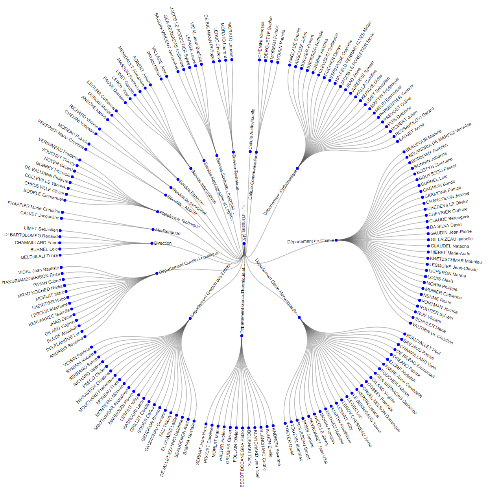

# IUT Orléans Directory scrapper to csv

## What
This python script scrape the university of Orléans directory and write the content as a csv file

The output file by default is _output.csv_ and can be changed in the script on line 8

The cvs file was used to create a web visualisation of the directory using d3.js
